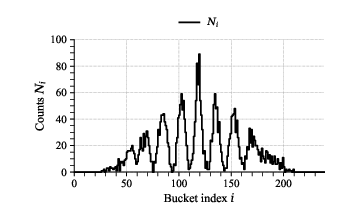
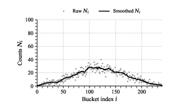

# Possibility/Actuality Ontology (P/A Ontology)

<p align="center">
  
  
  
  
  
  
</p>

## Executive Summary

The  [**P/A ontology**](#the-pa-ontology-constructive-witness) is a discrete, ray‑based physical model for closed systems that distinguishes actualized events from admissible futures. Its dynamics use finite causal propagation, local stable records, and event‑defined entanglement to reproduce **interference** and **Tsirelson‑bounded** correlations without Hilbert space, wavefunctions, or amplitudes. This provides a geometric, event‑driven framework that reproduces key empirical signatures while avoiding nonlocal update rules.

The ontology was developed as a constructive response to a [structural no-go result](#structural-nogo-theorem) showing that locally triggered, unbounded actualization rules are statistically incompatible with stable interference.

📘 **New to the ontology?** Start here: [Gentle_Introduction](Gentle_introduction.md)

🧭 **Where does the P/A ontology fit within the foundations literature?** See [Background_and_Context](Background_and_Context.md) for intellectual lineage, related approaches, and key references.

---

## Overview

This repository presents a four‑layer research program:

- [**Minimal realist axioms and postulates**](#minimal-realist-axioms-and-postulates) — modest structural commitments any ontology that claims to be realist is structurally required to satisfy.
- [**A structural no‑go theorem**](#structural-nogo-theorem) — showing that locally triggered, unbounded actualization rules are statistically incompatible with stable interference.
- [**The P/A ontology**](#the-pa-ontology-constructive-witness) — a constructive witness demonstrating that the axiomatic space is non‑empty and capable of reproducing interference and Tsirelson‑bounded correlations.
- [**Simulation results**](#simulation-results) — empirical demonstrations that the ontology’s structural commitments are computationally realizable and reproduce interference, which‑path suppression, and Tsirelson‑bounded nonlocal correlations.

Together, these components define a coherent framework for discrete, event‑driven physical ontology.

---

## Minimal Realist Axioms and Postulates
The repository begins with a set of minimal realist axioms and postulates. These define the structural space of ontologies capable of supporting locality, finite‑speed causal influence, stable records, interference, and Tsirelson‑bounded correlations. They do not presuppose quantum mechanics, wavefunctions, collapse, classicality, or any specific interpretation.

The full list is available in [01_Formal_Assumptions](01_Formal_Assumptions).

**Axioms**
* [Lawlike Regularity](01_Formal_Assumptions/01_Axiom_1_Lawlike_Regularity.md)
* [Universal Applicability](01_Formal_Assumptions/02_Axiom_2_Universal_Applicability.md)
* [Observer Independence](01_Formal_Assumptions/03_Axiom_3_Observer_Independence.md)

**Postulates**
* [Empirical Conservation](01_Formal_Assumptions/04_Postulate_4_Empirical_Conservation.md)
* [Finite‑Speed Local Dynamics](01_Formal_Assumptions/05_Postulate_5_Finite_Speed_Local_Dynamics.md)
* [Local Stable Records](01_Formal_Assumptions/06_Postulate_6_Local_Stable_Records.md)
* [Tsirelson‑Bounded Nonlocality](01_Formal_Assumptions/07_Postulate_7_Tsirelson_Bounded_Nonlocality.md)
* [Quantum Interference](01_Formal_Assumptions/08_Postulate_8_Quantum_Interference.md)
* [Local Availability of Triggers](01_Formal_Assumptions/09_Postulate_9_Local_Availability_Of_Trigger_States.md)
* [Weak Mixing / No Fine‑Tuning](01_Formal_Assumptions/10_Postulate_9b_Weak_Mixing_No_Fine_Tuning.md)

These assumptions define the minimal realist backdrop.
They are not tied to the P/A ontology; they define the structural landscape within which any ontology can be evaluated.

---

## Structural No‑Go Theorem
A central structural result shows that certain actualization rules are statistically incompatible with stable interference. The full derivation is available in [02_Structural_Results](02_Structural_Results).

### Main Theorem (Statistical No‑Go for Undivided Actualization)

>Let the ontology satisfy the [Axioms and Postulates](#minimal-realist-axioms-and-postulates).
Assume the Undivided Actualization Hypothesis (UAH): that there exists at least one actualization rule whose trigger is local but whose update domain is unbounded
> 
> **Theorem.**
> 
>Under these assumptions, there exists 
$p_0 > 0$
 such that the probability that interference persists across 
$N$
 independent runs of an interference experiment is at most
$$(1 - p_{0})^{N}$$.
Consequently, UAH‑type rules are statistically incompatible with indefinite repeatability of interference, except on a set of measure‑zero histories in the induced probability measure.

This establishes a structural constraint:
locally triggered, unbounded global actualization rules cannot coexist with stable interference.

---

## The P/A Ontology (Constructive Witness)
The P/A ontology is a constructive witness showing that the axiomatic space is not empty. It satisfies all axioms and postulates while avoiding [UAH](#structural-nogo-theorem) entirely.

Each of the ontological categories of the ontology are described formally in [03_Ontological_Categories](03_Ontological_Categories)

### Theoretical Overview
The ontology is built from two primitive [**carrier**](03_Ontological_Categories/06_Carrier.md) types:

- [**Particles**](03_Ontological_Categories/07_Particle.md) — proper‑time evolution, extended causal chains.
- [**Quanta**](03_Ontological_Categories/08_Quantum.md) — modal‑time propagation, at most two events (emission and absorption).

Actuality and possibility are represented by two structural sets:

- $A$ - the set of [**actualized events**](03_Ontological_Categories/05_Actuality.md), each involving a finite collection of carriers at specific spacetime coordinates.
- $P$ — the set of [**admissible modal futures**](03_Ontological_Categories/13_Possibility.md), encoded as [ray bundles](03_Ontological_Categories/10_Ray_Bundle.md) and [waypoints](03_Ontological_Categories/12_Waypoint.md). 

The dynamics of the ontology are governed by two operators:

- 𝒜 — the [**actualization operator**](03_Ontological_Categories/16_Actualization_Operator.md), which selects an admissible interaction and produces a new event in 
$𝐴$
.
- 𝒫 — the [**pruning operator**](03_Ontological_Categories/17_Pruning_Operator.md), which removes incompatible futures from $𝑃$ and enforces global causal consistency.

### Structural Resolution
UAH‑type rules destabilize interference because they allow locally triggered updates with **unbounded** global reach.
The P/A ontology avoids this by enforcing **strict locality for actualization** and **entanglement‑bounded reach for pruning**:

- 𝒜 **acts only locally**, on the finite set of carriers participating in an admissible interaction at a specific spacetime coordinate.
- 𝒫 **acts only on the involved particles and their entangled partners**, never on the full modal domain.

This division of labor ensures that:

- actualization events remain **geometrically local**,
- pruning remains **causally bounded**,
- update domains never become unbounded,
- and interference remains **stable** under repeated trials.

Together, these constraints provide the structural mechanism by which the ontology preserves interference while respecting locality and avoiding UAH‑type failures.

---

## Simulation Results
The [P/A ontology](#the-pa-ontology-constructive-witness) reproduces the qualitative structure of key quantum phenomena using only ray bundles, local compatibility, pruning, and actualization. These simulations demonstrate that the ontology’s structural commitments are computationally realizable and capable of producing nontrivial empirical signatures without wavefunctions or Hilbert‑space evolution.

### Double Slit — No Which‑Path Detection
Interference appears when no subsystem carries which‑path information.
The detection statistics cannot be represented as a convex mixture of exclusive path alternatives.




### Double Slit — With Which‑Path Detection
When a subsystem records which‑path information, interference is removed.
The detection statistics become a convex mixture over definite path alternatives.



### Bell Test — Tsirelson‑Bounded Correlations
A CHSH‑type experiment implemented with finite ray bundles, local actualization, and sparse conservation‑driven pruning yields correlations approaching the Tsirelson bound:

```code
E(a_0,b_0) = -0.6803
E(a_0,b_1) = -0.7130
E(a_1,b_0) = -0.7060
E(a_1,b_1) =  0.7099
```

giving a CHSH value: $S = 2.8091$, which is within the Tsirelson bound of $2\sqrt{2} \approx 2.8284$.

---

## Getting started
For a conceptual, jargon‑free walkthrough of the ontology’s core ideas, see the
[Gentle_Introduction](Gentle_Introduction.md).

For the intellectual lineage of the P/A ontology, related approaches, and key references in quantum foundations, see: [Background_and_Context](Background_and_Context.md)

---

## Conceptual Walkthroughs

To make the ontology accessible and intuitive, the repository includes
a set of conceptual walkthroughs of canonical quantum experiments:

- [Double slit experiment](06_Conceptual_Walkthroughs/01_Double_Slit_Experiment.md)
- [Bell/CHSH test](06_Conceptual_Walkthroughs/02_Bells_test.md)
- [Mach–Zehnder interferometer](06_Conceptual_Walkthroughs/03_Mach_Zhender.md)
- [Page-Geilker experiment](06_Conceptual_Walkthroughs/04_Page_Geilker.md)
- [Stern–Gerlach experiment](06_Conceptual_Walkthroughs/05_Stein_gerlach.md)
- [Delayed-choice quantum eraser](06_Conceptual_Walkthroughs/06_Delayed_Choice_Quantum_Eraser.md)
- [Schrödinger’s cat](06_Conceptual_Walkthroughs/07_Schrödingers_Cat.md)
- [Wigner’s friend](06_Conceptual_Walkthroughs/08_Wigners_Friend.md)

The walkthroughs are available in [06_Conceptual_Walkthroughs](./06_Conceptual_Walkthroughs)

These walkthroughs are not part of the formal ontology. They are provided
to illustrate how the P/A ontology accounts for the qualitative structure
of quantum phenomena using only ray bundles, local compatibility,
pruning, and actualization.

### Extended Walkthrough: The Hydrogen Atom

In addition to the experiment-level walkthroughs, the repository also
includes [a full-length conceptual analysis of the hydrogen atom](06_Conceptual_Walkthroughs/09_The_Hydrogen_Atom.md).  
This walkthrough is structurally deeper than the others and demonstrates
how discrete progression, curvature, and intersection-based actualization
give rise to the familiar $1/n^2$	 spectrum without wavefunctions or
continuous potentials.

It is included here in full to establish conceptual priority and to
provide a reference for future work. Like the other walkthroughs, it is
not part of the formal paper.

---

## Folder Structure
The full technical development is organized into these folders:

📂 [01_Formal_Assumptions](./01_Formal_Assumptions) — axioms and postulates

📂 [02_Structural_Results](./02_Structural_Results) — no‑go theorem and derived constraints

📂 [03_Ontological_Categories](./03_Ontological_Categories) — formal definition of carriers, events, ray bundles, and operators

📂 [04_Code (C#)](./04_Code_(C%23)) — Code for the simulations written in C#

📂 [05_Code_(Python)](./05_Code_(Python)) — Code for the simulations written in Python (conceptual only)

📂 [06_Conceptual_Walkthroughs](./06_Conceptual_Walkthroughs) — A set of conceptual walkthroughs of canonical quantum experiments

---

## Installation
For instructions on building and running the C# and Python simulations, see:

[Installation & Usage](./INSTALLATION.md)

---

## Contact
If you have questions about the P/A ontology, wish to discuss the structural results, or are interested in collaboration, you’re welcome to reach out.

**Christian Vibe Scheller**  
Kongens Lyngby, Denmark

- Email: [paontology@gmail.com](mailto:paontology@gmail.com)
- GitHub Issues: https://github.com/ChristianVibe/PA-Ontology/issues
- GitHub Discussions: https://github.com/ChristianVibe/PA-Ontology/discussions
